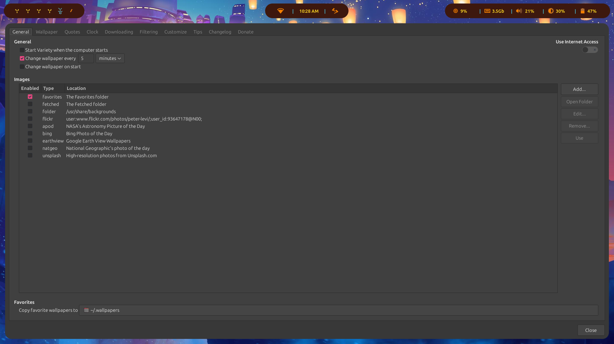

## Debian-based [AwesomeWM 4.3](https://awesomewm.org/) Setup

Browser, terminal, Rofi, GO!


## Installation

### 1) Download packages

Install AwesomeWM, Rofi app launcher, Picom compositor, lock screen
```
sudo apt-get update
sudo apt install awesome fonts-roboto rofi picom i3lock i3lock-fancy -y
```

Install miscellaneous dependencies
```
sudo apt install curl qt5-style-plugins materia-gtk-theme policykit-1-gnome -y
```

Install CLIs for screenshot tools, screen brightness adjuster, power manager, network manager, wallpaper manager, music player
```
sudo apt install xclip xbacklight flameshot nautilus xfce4-power-manager pnmixer network-manager-gnome variety mpg123 -y
```

### 2) Setup for Rofi Launcher

Make Rofi config directory, and import config to this directory
```
mkdir -p ~/.config/rofi
cp ~/.config/awesome/configuration/rofi.rasi ~/.config/rofi/config.rasi
sed -i '/@import/c\@import "~/.config/awesome/configuration/rofi.rasi"' ~/.config/rofi/config.rasi
```

Set up Rofi calculator from [Sventaro's repo](https://github.com/svenstaro/rofi-calc)
```
sudo apt install rofi-dev qalc libtool libtool-bin
git clone https://github.com/svenstaro/rofi-calc.git
cd rofi-calc/
mkdir m4
autoreconf -i
mkdir build
cd build/
../configure
make
# make install
```

Some minimal setup for music folder
```
mkdir -p ~/Music/
```

Simply open the Rofi manager with `Super + r` :D

### 3) Same theme for Qt/KDE applications and GTK applications, and fix missing indicators

First install `qt5-style-plugins` (debian) and add this to the bottom of your `/etc/environment`

```bash
XDG_CURRENT_DESKTOP=Unity
QT_QPA_PLATFORMTHEME=gtk2
```

The first variable fixes most indicators (especially electron based ones!), the second tells Qt and KDE applications to use your `gtk2` theme set through `lxappearance`.

### 4) Wallpapers

Set wallpapers for Variety in `~/.wallpapers/`

Feel free to use different wallpapers and edit them but here's what I have
```
cp -r ~/.config/awesome/.wallpapers ~/
```

You'll also need to configure a few settings in Variety like adding the `.wallpapers` location and checking which wallpapers you want it to fetch. You can also let Variety change your wallpaper every so often!

